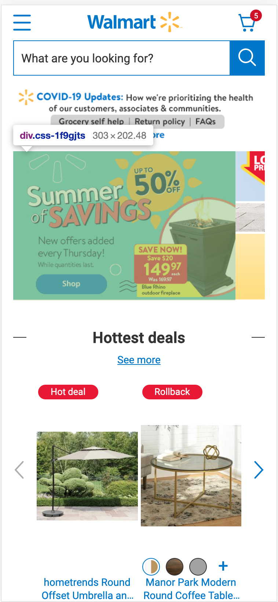
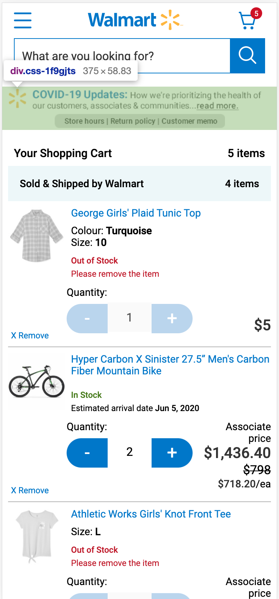
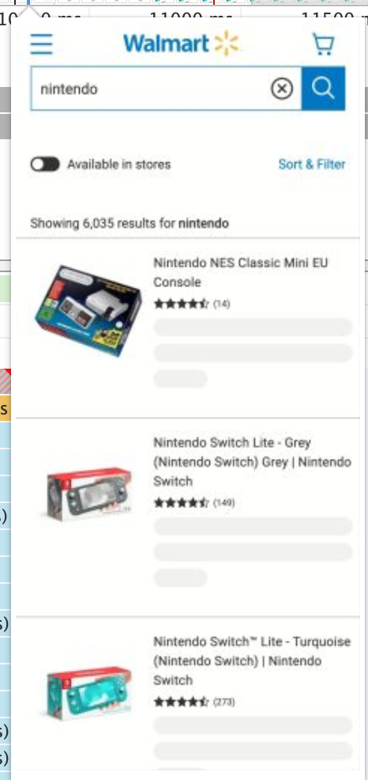
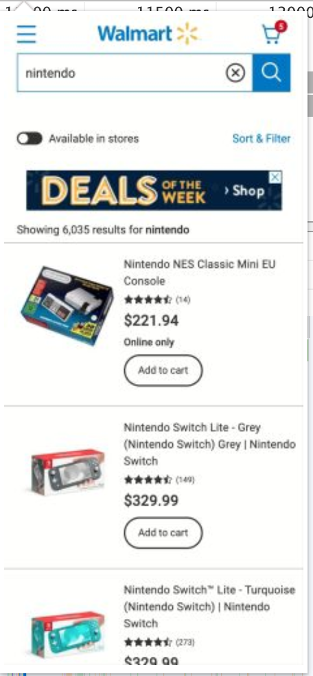

footer: 📈

[.autoscale: true]

# 🚀 Performance Dev Talk Series

## 📈 Modern Frontend Performance Metrics

---

## Why should we care about performance?

---

**We care about performance because we care about our users**

We want to make their experience delightful and frictionless, and earn their loyalty and continued patronage

---

**We care about performance because we care about our business**

Studies show that [100ms latency improvements -> 1% improvement in conversion](https://www.gigaspaces.com/blog/amazon-found-every-100ms-of-latency-cost-them-1-in-sales/)!

---

## Why do we care about performance metrics?

[.build-lists: true]

- Performance metrics are a proxy for user experience and business impact
- Engineers have more control over them then most other aspects of the product that can impact customers and revenue so much
- They are measurable over time, so we can measure the impacts of our performance work, and analyze what types of performance engineering delivers the most value

---

## What do performance metrics help us answer?

[.build-lists: true]

- Is it happening?
- Is it useful?
- Is it usable?
- Is it delightful?

---

## What kinds of performance metrics are there?

[.build-lists: true]

- Synthetic (lab)
- Real User Metrics - RUM (field)

---

## What are synthetic metrics good for?

[.build-lists: true]

- Synthetic metrics are an important part of the development process. They help you catch regressions before they are released to customers
- They also run against a fixed performance profile, enabling you track stricly how your frontend/orchestration/network improve over time. You can also mock and block backend services for even further isolation and determinism

---

## What is RUM good for?

[.build-lists: true]

- RUM tells us you how our actual users experience our site
- Synthetic benchmarks may trend one way, but RUM metrics may trend independently, based on devices breakdown, network speeds, or usage patterns

---

## What metrics should we track?

[.autoscale: true]

[.build-lists: true]

- **First contentful paint (FCP)**: When the page starts loading to when any of the page's content is rendered _(lab, field)_
- **Largest contentful paint (LCP)**: When the page starts loading to when the largest text block or image element is rendered _(lab, field)_
- **First input delay (FID)**: When the user first interacts with your site to when the browser is able to respond _(field)_
- **Time to Interactive (TTI)**: When the page starts loading to when it's visually rendered, its initial scripts have loaded, and it's capable of reliably responding to user input _(lab)_
- **Total blocking time (TBT)**: Total amount of time between FCP and TTI where the main thread was blocked for long enough to prevent input responsiveness _(lab)_
- **Cumulative layout shift (CLS)**: Cumulative score of all unexpected layout shifts between when page loading and exiting _(lab, field)_

---

## What about custom metrics?

[.build-lists: true]

- Often times, the most important element or aspect of page performance may not be covered by the heuristic based metrics
- For these situations, we should use custom metrics
- Examples: Offers loaded for product page, basket fully loaded in cart, carousels loaded in homepage

---

## Web Vitals

---

## Web Vitals

[.autoscale: true]

[.build-lists: true]

- Simplify the landscape, make it easy to understand and measure
- Prioritize the most important user centric metrics
- Choesive push across all Google tools ([Chrome User Experience Report](https://developers.google.com/web/tools/chrome-user-experience-report), [Pagespeed Insights](https://developers.google.com/speed/pagespeed/insights/), [Search Console](https://support.google.com/webmasters/answer/9205520))
- Search algorithm to be updated to prioritize web vitals (EOY)
- 3rd party tools ecosystem updated (Speedcurve, Calibre etc)

---

---

## The Web Vitals

[.autoscale: true]

[.build-lists: true]

- **Largest Contentful Paint** (LCP): measures loading performance. To provide a good user experience, LCP should occur within 2.5 seconds of when the page first starts loading.
- **First Input Delay** (FID): measures interactivity. To provide a good user experience, pages should have a FID of less than 100 milliseconds.
- **Cumulative Layout Shift** (CLS): measures visual stability. To provide a good user experience, pages should maintain a CLS of less than 0.1.

---

## Largest Contentful Paint

**Why LCP?**

[.autoscale: true]

[.build-lists: true]

- Low LCP helps ensure the site is **useful**
- Older metrics like `load`, `FCP`, `FMP`, `SI` either not always meaningful or are hard to measure and unreliable
- LCP captures the most important visual loading elements: `img`, `image`, block level elements, poster element of `video`

**How to improve LCP:**

- Ensure fast server response times
- Remove render blocking JS and CSS
- Improve resource load times
- Client render non-critical elements

---

## Largest Contentful Paint

### LCP examples from Walmart.ca

[.autoscale: true]

---

## First Input Delay

[.autoscale: true]

[.build-lists: true]

**Why FID?**

- Quantifies the experience of users when interacting with the site. Low FID helps ensure the site is **usable**
- Measure the time from when the user first interacts with your site, to when the browser is able to respond. Applies not only to event listeners, but also to text boxes, inputs, links etc
- Is affected by script size, and especially JS long tasks

**How to improve FID:**

- Reduce JS size, code split
- Decrease blocking 3rd party scripts
- Keep request counts low

---

## First Input Delay

---

## Cumulative Layout Shift

[.autoscale: true]

[.build-lists: true]

**Why CLS?**

- Quantifies the **delight factor** when using the page
- Measures how often undesirable layout shifts happen for customers

**How to improve CLS:**

- Always include size attributes
- Use loading state
- Insert new content below existing content
- User transform animations

---

## Cumulative Layout Shift

### CLS example from Walmart.ca

---

What's next?

---

## 🚀 Performance Dev Talk Series

[.build-lists: true]

- Walmart Canada performance engineering workflow
- Walmart Canada performance engineering tools and roadmap
- Performance tools deepdive: Lighthouse & WebPageTest
- Performance tools deepdive: Chrome
